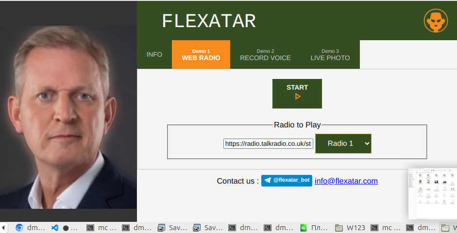
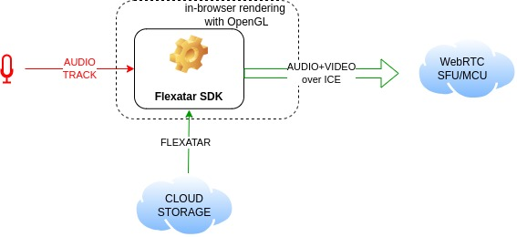
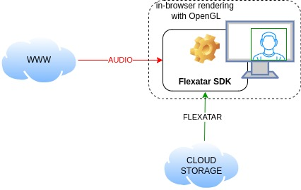

# Flexatar Virtual Webcam

 **Flexatar Virtual Webcam** is the technology that

1. Creates a 3d model (called **flexatar**) from just a single photo in a few seconds.
2. Animate audio with **flexatar** in **browser (on the device, inc mobile) in hard realtime**
   


Our technology is intentionally designed for **WebRTC**!

## Demo
[](https://www.flexatar-sdk.com/demo)

To start with, [PLEASE TAKE A LOOK at our demo](https://www.flexatar-sdk.com/demo) of animating **flexatar** with web radio in your browser.

You can find the preliminary examples [here](examples)

## Scenarios

### Scenario 1: Webrtc Virtual Webcam :microphone:
The key advantage of **flexatar** technique is that it can be used to animate user's audio track from microphone, thus acting as a virtual webcam for **WebRTC**.

We are planning to commit integration examples to leading WebRTC SFU's like Janus, Livekit etc. Feel free to offer candidates.



The procedure is as follows:
1. getUserMedia() with **audio only**
2. audio is delivered to [FlexatarSDK](FlexatarSDK.js)
3. **FlexatarSDK** supplies both **audio** and **video** tracks ensuring lipsyncing  

```
  navigator.mediaDevices
    .getUserMedia({audio: true,})
    .then((stream) => {
        flexatarSDK.audioInputByMediaStrem(stream)
    })
```

_We are planning to share the example of interfacing [pion](https://github.com/pion/webrtc) soon_

### Scenario 2: Animating audio for user :headphones:

We are targeting obvious applications like virtual assistants, bots etc. The [demo](https://www.flexatar-sdk.com/demo) provides an idea how it works.

All you need is to
- init FlexatarAnimator with token and link to the flexatar
- provide audio
- connect output to a video element

```
videoElement.srcObject = ftar.FlexatarSDK.mediaStreamFactory(
    "<token>",
    "<flexatar link from telegram bot>",
    mediaStream, // media stream with audio track
    (success) => {
        if (success){
            // Do your awesome stuff ...
        }else{
            console.log("Flexatar media stream is unavailable")
        }
    }
)
```

In the context of the mentioned scenario, we are working on integration with

- various frontend frameworks
- popular Text-To-Speech (TTS) services

Stay tuned!


### Scenario 3: Making static images "Magic" :movie_camera:
Like in Magic movies: a photo starts moving.
From the technical point of view: no need to fetch audio features and animate as above, animation pattern is enough.

## FAQ

1.What **flexatar** stands for?  

- **Flexatar** is our format of storing **3d model of human face**, capable of online animating **in browser in realtime using WebGL**.
 
2.Can I make a **flexatar** by my own?

- Sure. Just send a photo to our [telegram bot](https://t.me/flexatar_bot)
 
3.Is it 3D?
 
 - Yes! We can export flexatar as a conventional **.obj** file with 3d model and textures. If you are a game developer and need either a custom 3d or a morphable model, please feel free to contact us

4.What's under the hood?

 - Our in-house math runs on backend to compute and store **flexatars**
 - Rendering is performed in JS with WebGL

5.How much time does it take to create a **flexatar**?
 
 - It takes couple of seconds to compute **flexatar** on GPU by photo, and few more seconds to deliver/queue etc. Making high quality flexatar with custom mouth takes about 10 seconds

6.Is the technology scalable?

 - Yes. The backend runs on AWS and is intended to be extremely scalable, both in terms of **flexatar** creation and use

7.Mobile SDK?

 - Scheduled

8.Any restrictions?
 
 - All the flexatars must be stored on our resources exclusively. It is prohibited to store or cache **Flexatars**
 - **Flexatars** belong to both the person who owns the image and us who created it and can't be used by any side without mutual agreement
 - We'll charge for commercial use of our technology
 - LICENSE is to be published soon