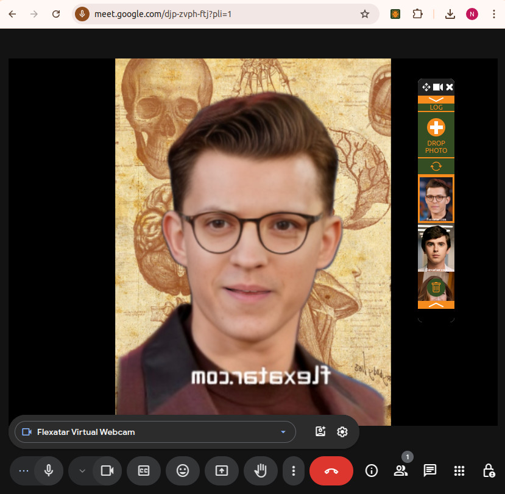
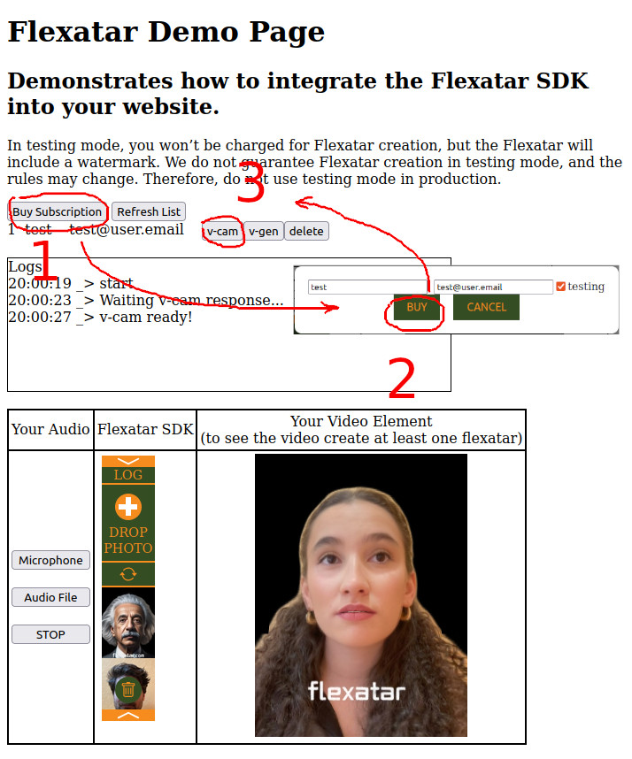
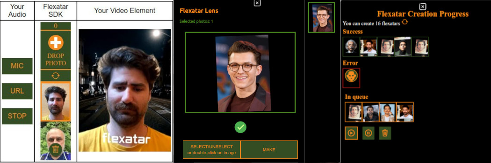

# Flexatar Virtual Webcam

## The Brief Introduction

This SDK provides Realtime Virtual Camera for video calls.

[Check video how it works on google meet](https://youtu.be/lSAOyMQc3m4)

[](https://youtu.be/lSAOyMQc3m4)


Our product enables to animate audio on the fly *(1)* in a browser *(2)* with your personal 3D model *(3)* called flexatar.

This means

1. Animating in **real-time** enables you to implant flexatars to any service, from WebRTC online meetings to chatbots with AI
2. The capability to run on the device makes **scaling** trivial and eliminates the need for GPU-powered backend
3. Your customers can easily make 3D models by their own, and it takes about 15 seconds

Last but not least, we are provideing effects like mixing different models and introducing emotions


## Quick start 

- Obtain **FLEXATAR_API_SECRET** from [Flexatar Web Page](https://flexatar-sdk.com).
- Create ".env" file with content FLEXATAR_API_SECRET=`<your api key>`


### 📁 flexatar-virtual-webcam
- 📁 doc
- 📁 img
- 📁 src
- 📄 .env
- 📄 run-server.sh 
- 📄 run-docker.sh 
- 📄 ...

### AI Agent With Video Avatar — Minimal Demo
- You want to turn your voice agent into a video agent.
- Normally this is expensive and requires servers with GPUs.
- With our solution, everything runs locally, offline, with no dependency on third-party infrastructure.
- It’s inexpensive, and for testing and development it’s completely free.

Minimal working example of integrating a Flexatar avatar into a web page.
The demo showcases how to synchronize an animated video avatar with a live audio stream, making the avatar "speak" in real time.

#### Instructions

1. **Embed the code snippet** — insert the provided HTML/JS code into your web page.  
2. **Provide a MediaStream with an audio track** — for example, from a microphone or AI voice.  
3. **Use the synchronized stream for playback** — the SDK returns a stream aligned with the avatar’s lip-sync.  
4. **Create your own Flexatar** — customize and generate avatars on the [Flexatar SDK website](https://flexatar-sdk.com).  

```html
<html>

<body>

    <canvas id="flexatarCanvas"></canvas>
   
    <script type="module">
        import * as SDK from "https://flexatar-sdk.com/files/easy-renderer.js"
        console.log(SDK)
        const canvas = document.getElementById("flexatarCanvas");
        const renderer = new SDK.FtarRenderer("https://flexatar-sdk.com/files", canvas);
        renderer.readyPromise.then(async () => {
            renderer.size={width:320,height:320}
            //Url to flexatar
            renderer.slot1 = "https://flexatar-sdk.com/files/default_ftar.p";
            //Url to background image
            renderer.background = "https://flexatar-sdk.com/files/backgrounds/bkg_chatgpt_1.png";
           
            // Attach a MediaStream with an audio track
            navigator.mediaDevices.getUserMedia({ audio: true }).then(stream => {
             
              // streamForPlayback: synchronized audio with avatar animation
              const synchronizedStreamForPlayback = renderer.connectMediaStream(stream);
            })

          });
    </script>
</body>
</html>
```

### Flexatar API — Step-by-Step Guide 

> Replace placeholders like `{YOUR_API_SECRET}` and `{flexatar-id}` with actual values.  
> Use curly braces `{}` instead of `< >` to avoid Markdown/HTML rendering issues.


[NodeJS example](quickstart/server.js)

Run:
```
node server.js
```
In browser:
```
http://localhost:8082
```
---


#### 1. Request a Presigned Upload Link

**HTTP**: `POST`  
**Endpoint**:
```
https://api.flexatar-sdk.com/b2b/createflexatar
```

**Headers**:
- `Authorization: Bearer {YOUR_API_SECRET}`

**Response**: JSON object (e.g. `flexatarCreationInfo`) containing at least:
- `link.url` — the URL where you should upload the form
- `link.fields` — the fields required for the `multipart/form-data` upload
- `poll` — the URL to check the processing status

---

#### 2. Upload the Image

1. Build a `multipart/form-data` request including all key-value pairs from `link.fields`.
2. Add the image file itself to the form. The field name for the file depends on the presigned form — `file`.
3. Send a `POST` request to:
```
{link.url}
```
(this is the value from `flexatarCreationInfo.link.url`)

**Important**: For presigned uploads (e.g. S3 POST), all fields from `link.fields` must be included exactly as provided. Do not add or change any values.

**Example (curl — template)**:
```
curl -X POST   -F "field1=value1"   -F "field2=value2"   -F "file=@/path/to/your-image.jpg"   "https://.../presigned-upload-url"
```
Replace `field1=value1`, `field2=value2` with actual pairs from `link.fields`, and `https://.../presigned-upload-url` with `link.url`.

---

#### 3. Poll for Processing Status

- Send periodic `GET` requests to:
```
{poll}
```
(value from `flexatarCreationInfo.poll`).

- The server returns JSON with a `status` field (and possibly more info). 


---

#### 4. Retrieve the Result — Preview and Download

Once processing is complete, you can access the Flexatar in two ways:

- **Preview (quick view)**  
```
https://api.flexatar-sdk.com/b2b/createflexatar/preview/{flexatar-id}
```

- **Download (final Flexatar)**  
```
https://api.flexatar-sdk.com/b2b/createflexatar/ftar/{flexatar-id}
```
A request to `/ftar/{flexatar-id}` returns JSON with a `link` field containing the actual download URL.

**Example (curl — fetch download link JSON)**:
```
curl "https://api.flexatar-sdk.com/b2b/createflexatar/ftar/{flexatar-id}"
```
Response example:
```json
{
  "link": "https://.../download-file-url"
}
```
Download the file using the URL in `link` (via `curl -O` or in a browser).

---


## Prebuilt UI for Easy Integration into Video Conferencing
Deploy a local demo web app showcasing integration with the Flexatar SDK.

### With Bash Script 

 Install [Node.js](https://nodejs.org/en/download)
  ``` 
  ./run-server.sh
  ```
  > Note: On windows use `Git Bash` to run script.

### Or With Docker 

 Install [Docker](https://docs.docker.com/engine/install/)

  ``` 
  ./run-docker.sh
  ```

 
Visit the demo server in your browser at: [localhost:8081/main](http://localhost:8081/main)



## Integration

To integrate you need to look through examples:
- [initialization of virtual camera](src/server/src/vcam-creator.js)
- [Server](src/server/server.js) example that you need to implement on your backend, to make camera works.

> Note: FLEXATAR_API_SECRET - provides access to user subscription management, allows **user token** creation.
> To initialize camera and access user's flexatars you need **user token**.

> IMPORTANT: Use FLEXATAR_API_SECRET on your backend **ONLY**, for security reasons.

To make integration seamless, we provide JavaScript libraries, each utilizing an underlying i-frame but offering additional functionality and UI for different use cases.

[](https://flexatar-sdk.com)

### 1. AI Assistants & WebRTC Virtual Camera
The Virtual Camera Package [flexatar-package](./src/flexatar-package) provides functionality and UI for virtual camera. It includes an iframe-based UI for controlling the video output, allowing users to create Flexatars, switch between different Flexatars and adjust emotions. This solution can be used in various scenarios, such as:

- WebRTC Virtual Camera – Acts as a virtual webcam, providing a new capture device alongside physical cameras.

- AI Virtual Assistant – Can be used to create interactive AI-driven avatars that respond naturally. In this case, the UI for creating and deleting Flexatars can be hidden for a more streamlined experience.


### 2. Creating videos

The Video Generator Library [v-gen](./src/v-gen-lib/README.md) provides a UI and functionality for generating videos with talking heads synchronized to audio. It allows users to create and customize video content easily within your webpage.

Our solutions are designed for easy embedding and customization, enabling you to integrate talking avatars into your applications effortlessly.


### 3. Interfacing our backend
All out I-frames from above are interworing with our backend. Our customers are getting Secrets from us, that enables them to request Tokens to serve their end-users.

We are also providing test access to help our customers tune interfacing with both our backend and end-users. 

The node.js example of customer-side backend can be found [here](./src/server)

The terms of use are presented at [our website](https://flexatar.com)


## Under the hood

Flexatar technology comprises the following:

- Our unique proprietary algorithm to **create** truely 3D **flexatars** from photo(s) or videos (for enchanced version). Computing is performed on our backend, and it takes about 15 seconds. 


- In-browser real-time **animation** of 3D flexatars with effects. The tiny delay is introduced to compute *phoneme* animation, that is combined with *animtion patterns* making flexatars look alive. Flexatar applied for animating can be either original one or a morph of flexatars with emotions and effects which are controlled by a user. The animaton delay is a compromise between an adequate voice-driven animation and the processing duration. To compensate such a delay and ensure lipsync, the delayed audio track is provided alongside with video.

Flexatars are created and stored in our AWS-hosted backend, being supplied to a browser directly.
Our customer is expected to request Tokens per user session from backend by Secret. These Tokens are used to account end-users activities. 

## Commercial

Each request to **https<nolink>://api.flexatar-sdk.com/b2b/buysubscription** incurs a charge.

Upon completing the request, you will receive a 1 month subscription for the specified user, which includes:

- **20 Flexatar creations**
- **100 sessions**

**Expired Subscription Mode**

Once a subscription expires, the user can continue to access the Flexatar SDK; however:
- **Flexatar creations and deletions will be disabled**
- **Sessions can still be used at fixed cost per session**

> Note: A session is defined as the use of the Flexatar SDK from a single IP address within one day.

Visit [pricing page](https://flexatar-sdk.com/?tab=dev) to know more.