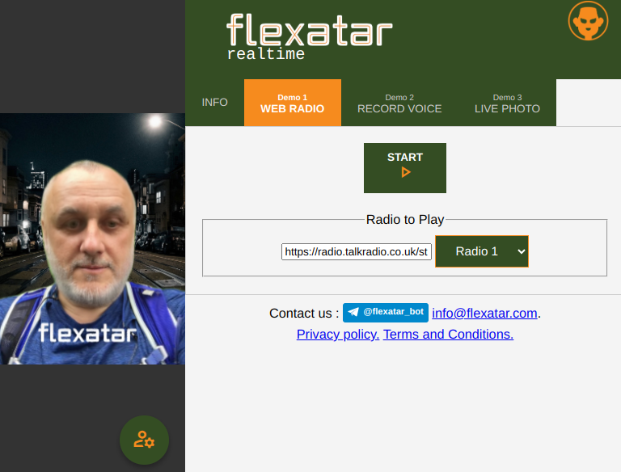
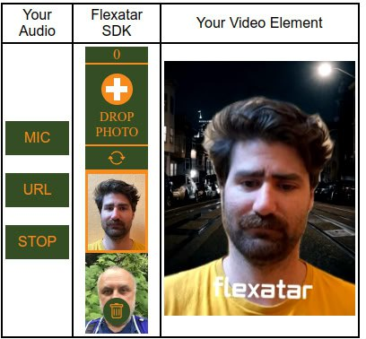
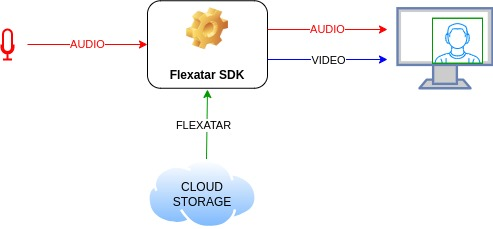

# Flexatar Virtual Webcam

## The Brief Introduction

Our product enables to animate audio on the fly *(1)* in a browser *(2)* with your personal 3D model *(3)* called flexatar.

This means

1. Animating in **real-time** enables you to implant flexatars to any service, from WebRTC online meetings to chatbots with AI
2. The capability to run on the device makes **scaling** trivial and eliminates the need for GPU-powered backend
3. Your customers can easily make 3D models by their own, and it takes about 15 seconds

Last but not least, we are provideing effects like mixing different models and introducing emotions

[](https://flexatar-sdk.com/demo/)

[Please take a look at our demo](https://flexatar-sdk.com/demo/) to get an idea how it looks. It makes sense to start with **Web Radio** App.


## Quick start 

- Obtain **FLEXATAR_API_SECRET** from [Flexatar Web Page](https://flexatar-sdk.com).
- Create .env file "flexatar-demo.env" with content FLEXATAR_API_SECRET=<your api key>
- Edit run-server.sh or run-docker.sh to link your .env file


Deploy a local demo web app showcasing integration with the Flexatar SDK.

### With Bash Script 

 Install [Node.js](https://nodejs.org/en/download)
  ``` 
  ./run-server.sh
  ```

### Or With Docker 

 Install [Docker](https://docs.docker.com/engine/install/)

  ``` 
  ./run-docker.sh
  ```

 
Visit the demo server in your browser at: [localhost:8081/main](http://localhost:8081/main)


## Integration

To make integration seamless, we provide JavaScript libraries, each utilizing an underlying i-frame but offering additional functionality and UI for different use cases.

[](https://flexatar-sdk.com)

### 1. AI Assistants & WebRTC Virtual Camera
The Virtual Camera Library [v-cam](./src/v-cam-lib) takes an audio source as input and outputs a synchronized (audio+video) stream. It includes an iframe-based UI for controlling the video output, allowing users to create Flexatars, switch between different Flexatars and adjust emotions. This solution can be used in various scenarios, such as:

- WebRTC Virtual Camera – Acts as a virtual webcam, providing a new capture device alongside physical cameras.

- AI Virtual Assistant – Can be used to create interactive AI-driven avatars that respond naturally. In this case, the UI for creating and deleting Flexatars can be hidden for a more streamlined experience.


### 2. Creating videos

The Video Generator Library [v-gen](./src/v-gen-lib/README.md) provides a UI and functionality for generating videos with talking heads synchronized to audio. It allows users to create and customize video content easily within your webpage.

Our solutions are designed for easy embedding and customization, enabling you to integrate talking avatars into your applications effortlessly.


### 3. Interfacing our backend
All out I-frames from above are interworing with our backend. Our customers are getting Secrets from us, that enables them to request Tokens to serve their end-users.

We are also providing test access to help our customers tune interfacing with both our backend and end-users. 

The node.js example of customer-side backend can be found [here](./src/server)

The terms of use are presented at [our website](https://flexatar.com)


## Under the hood

Flexatar technology comprises the following:

- Our unique proprietary algorithm to **create** truely 3D **flexatars** from photo(s) or videos (for enchanced version). Computing is performed on our backend, and it takes about 15 seconds. 



- In-browser real-time **animation** of 3D flexatars with effects. The tiny delay is introduced to compute *phoneme* animation, that is combined with *animtion patterns* making flexatars look alive. Flexatar applied for animating can be either original one or a morph of flexatars with emotions and effects which are controlled by a user. The animaton delay is a compromise between an adequate voice-driven animation and the processing duration. To compensate such a delay and ensure lipsync, the delayed audio track is provided alongside with video.

Flexatars are created and stored in our AWS-hosted backend, being supplied to a browser directly.
Our customer is expected to request Tokens per user session from backend by Secret. These Tokens are used to account end-users activities. 

## Commercial

Each request to **https<nolink>://api.flexatar-sdk.com/b2b/buysubscription** incurs a charge.

Upon completing the request, you will receive a 1 month subscription for the specified user, which includes:

- **20 Flexatar creations**
- **100 sessions**

**Expired Subscription Mode**

Once a subscription expires, the user can continue to access the Flexatar SDK; however:
- **Flexatar creations and deletions will be disabled**
- **Sessions can still be used at fixed cost per session**

> Note: A session is defined as the use of the Flexatar SDK from a single IP address wit

Visit [pricing page](https://flexatar-sdk.com/?tab=dev) to know more.