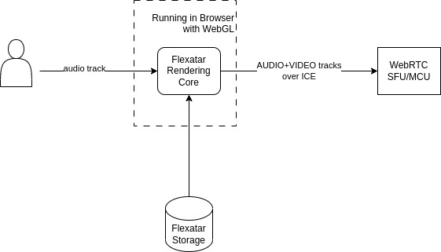

# Flexatar Virtual Webcam

**_This is still Work In Progress, will be finished soon._**

**Flexatar Virtual Webcam** is the technology that

1. Creates a 3d model (called **flexatar**) from
- Just single photo (with default mouth and minor quality) 
- A set of 5 photos plus mouth (optionally) provides better quality and real mouth, which is to be positioned manually
- Short video 
2. Animate audio with **flexatar** in browser/on the device in hard realtime
- Audio track is enough to make **flexatar** "speak"
- We can issueq various effects, mixing/morphing flexatars on the fly

## Demo
To start with, [get an impression](https://86s46xzcnk.execute-api.us-east-1.amazonaws.com/default/demo) of animating **flexatar** with web radio in your browser. 
The **flexatar** is created from a single portrait in few seconds. 

You can find the preliminary examples [here](examples)

## Scenarios

### Scenario 1: Animating audio for user
We are targeting obvious applications like virtual assiatances, bots etc. The [demo](https://86s46xzcnk.execute-api.us-east-1.amazonaws.com/default/demo) provides an idea how it works.

In the context of the mentioned scenario, we are working on integration with

- various frontend frameworks
- popular TTS services

Stay tuned!

### Scenario 2: Webrtc Virtual Webcam
The key advantage of **flexatar** technique is that it can be used to animate user's audio track from microphone, thus acting as a virtual webcam for **WebRTC**.
We are planning to commit integration examples to leading WebRTC SFU's like Janus, Livekit etc. Feel free to offer candidates.

The procedure is as follows:
1. getUserMedia() with **audio only**
2. audio is delivered to [FlexatarSDK](FlexatarSDK.js)
3. **FlexatarSDK** supplies both **audio** and **video** tracks ensuring lipsyncing   
_We are planning to share the example of interfacing [pion](https://github.com/pion/webrtc) soon_

### Scenario 3: Making static images "Magic"
Like in Magic movies: a photo starts moving. 
From the technical point of view: no need to fetch audio features and animate as above, animation pattern is enough.

## Other Solutions
### Browser Extension
Is scheduled. The current version is outdated, we are planning to revert.

### Unofficial Telegram Client
Last but not least: we are providing Flexatar Telegram clients, that are capable to create **flexatars** and use them for
- video calls 
- video conferences
- record circles

Android version is [available](https://play.google.com/store/apps/details?id=org.flexatartelegram.messenger), IOS one is still under review, for several months already

## FAQ
1. What **flexatar** stands for?
- **Flexatar** is our format of storing **3d model of human face**, capable of online animating **in browser in realtime using WebGL**.
2. Can I make a **flexatar** by my own?
- Sure.
3. Is it 3D?
- Yes! We can export flexatar as a conventional **.obj** file with 3d model and textures. If you are a game developer and need either a custom 3d or a morphable model, please feel free to contact us
4. What's under the hood?
- Our in-house math runs on servers compute and store **flexatars**
- Rendering is performed in JS with WebGL
5. How much time does it take to create a **flexatar**?
- It takes couple of seconds to compute **flexatar** on GPU by photo, and few more seconds to deliver/queue etc. Making high quality flexatar with custom mouth takes about 10 seconds
6. Is the technology scalable?
- Yes. The backend runs on AWS and is intended to be extremely scalable, both in terms of **flexatar** creation and use
7. Mobile SDK?
- Scheduled
8. Any restrictions?
- We are insisting on computing and storing **Flexatars** on our resources only. It is prohibited to store or cache **Flexatars**
- **Flexatars** belong to both the person who owns the image and us who created it and can't be used by any side without mutual agreement
- We'll charge for commercial use of our technology
- LICENSE is to be published soon

